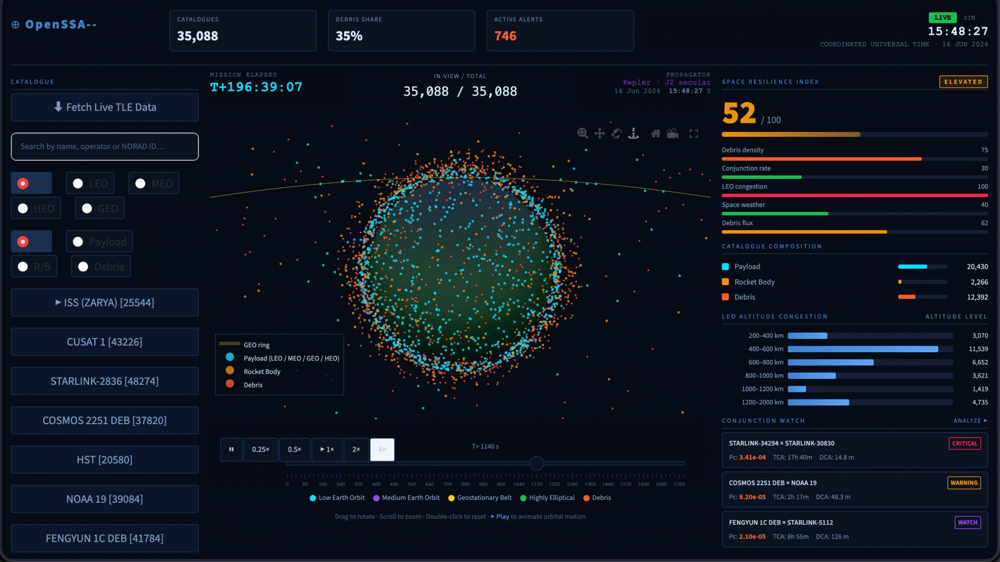

# OpenSSA-- (minus minus) — Space Situational Awareness Dashboard

An interactive, real-time Space Situational Awareness dashboard built with Streamlit and Plotly.



## Features

- **3D Animated Globe** — interactive Plotly globe with 35,000+ orbital objects rendered using Keplerian mechanics
- **Live UTC clock** — real-time ticking clock in the header
- **Multi-speed playback** — ⏸ / 0.25× / 0.5× / ▶ 1× / 2× / 4× buttons inside the chart (no page reload, zoom preserved)
- **Dark space theme** — full dark UI styled to match mission-control aesthetics
- **Object catalogue** — 35,088 objects split across Payload, Rocket Body, and Debris categories
- **Analytics panel** — Space Resilience Index, LEO congestion bands, conjunction watch
- **Celestrak TLE fetch** — optional live TLE data with SSL-bypass fallback

## Catalogue breakdown

| Category     | Count  |
|--------------|--------|
| Payload      | 20,430 |
| Rocket Body  |  2,266 |
| Debris       | 12,392 |
| **Total**    | **35,088** |

Notable debris clouds: FY-1C ASAT (2007), Iridium-Cosmos collision (2009)

## Quick start

```bash
pip install -r requirements.txt
streamlit run app.py
```

Open http://localhost:8501 in your browser.

## Requirements

- Python 3.10+
- streamlit >= 1.35.0
- plotly >= 5.22.0
- pandas >= 2.0.0
- numpy >= 1.26.0

## Controls

| Control | Action |
|---------|--------|
| Click + drag | Rotate globe |
| Scroll | Zoom in/out |
| ⏸ / ▶ 1× buttons | Pause / play animation |
| 0.25× – 4× buttons | Change playback speed |
| Time slider | Jump to specific frame |

## Architecture

- `build_catalogue()` — generates the 35,088-object catalogue with realistic orbital distributions (cached)
- `kep_to_xyz()` — Keplerian elements → ECI Cartesian coordinates in Earth radii
- `make_animated_globe()` — builds a 90-frame Plotly animation (20 s/frame of simulated time)
- `_clock_html()` — self-contained HTML/JS clock rendered via `st.iframe()` for real-time ticking
